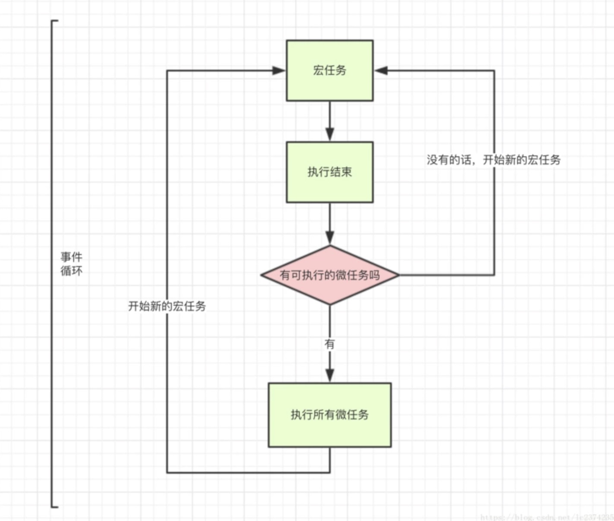

# 函数式编程
  - 对运算过程进行抽象，用来描述数据(函数)的映射
  - 不是程序中的方法，而是数学中的函数


1. 函数是一等公民：
             

    - 函数可以存在变量中
   ```
      let fn = function(){
         console.log('hello')
      }    
   ```
    - 函数作为参数
   ```
   functionforEach (array, fn) {
      for (let i = 0; i < array.length; i++) {
         fn(array[i]) 
      }
   }
   ```
    - 函数作为返回值
   ```
   function makeFn(){
      let msg = 'hello';
      return function(){
         console.log(msg)
      }     
   }
   ```

2. 高阶函数：
    - 可以把函数作为参数传递给另一个函数
    - 可以把函数作为另一个函数的返回结果

      - 使用高阶函数的意义：
        不用关注细节，只关注目标
        用来抽象通用问题
        使代码更简洁

      - 常用的高阶函数：forEach，map，filter，every，some，find，findIndex，reduce，sort

3. 闭包：
    - 函数和其周围的状态(词法环境)的引用捆绑在一起形成闭包
    - 可以在另一个作用域中调用一个函数的内部函数并访问到该函数的作用域中的成员


      - 闭包的本质：函数在执行的时候会放到一个执行栈上当函数执行完毕之后会从执行栈上移除，但是堆上的作用域成员因为被外部引用不能释放，因此内部函数依然可以访问外部函数的成员
   ```
   function makeFn(){
      let msg = 'hello';
      return function(){
         console.log(msg)
      }     
   }
   ```

4. 纯函数：
   - 相同的输入永远会得到相同的输出，而且没有任何可观察的副作用
     - 好处：可缓存，可测试，并行处理
  
6. 副作用：
   - 副作用让一个函数变的不纯(如上例)，纯函数的根据相同的输入返回相同的输出，如果函数依赖于外部的状态就无法保证输出相同，就会带来副作用。
     - 来源：配置文件，数据库，获取用户输入...

7. 柯里化：
   - 当一个函数有多个参数的时候先传递一部分参数调用它（这部分参数以后永远不变）
   - 然后返回一个新的函数接收剩余的参数，返回结果

     - 柯里化可以让我们给一个函数传递较少的参数得到一个已经记住了某些固定参数的新函数
     - 这是一种对函数参数的'缓存'
     - 让函数变的更灵活，让函数的粒度更小
     - 可以把多元函数转换成一元函数，可以组合使用函数产生强大的功能

8. 函数组合：
   - 函数组合可以让我们把细粒度的函数重新组合生成一个新的函数
     - 如果一个函数要经过多个函数处理才能得到最终值，这个时候可以把中间过程的函数合并成一个函数
     - 函数就像是数据的管道，函数组合就是把这些管道连接起来，让数据穿过多个管道形成最终结果
     - 函数组合默认是从右到左执行
9.  管道

10. 函子 
   - 容器：包含值和值的变形关系，这个变形关系就是函数
   - 函子：是一个特殊的容器，通过一个普通的对象来实现，该对象有map方法，map方法可以运行一个函数对值进行处理（变形关系）

     - 函数式编程的运算不直接操作值，而是由函子完成
     - 函子就是一个实现了 map 契约的对象
     - 我们可以把函子想象成一个盒子，这个盒子里封装了一个值
     - 想要处理盒子中的值，我们需要给盒子的 map 方法传递一个处理值的函数（纯函数），由这个函数来对值进行处理
     - 最终 map 方法返回一个包含新值的盒子（函子）

- MayBe 函子的作用就是可以对外部的空值情况做处理（控制副作用在允许的范围）
- 异常会让函数变的不纯，Either 函子可以用来做异常处理
- IO 函子可以把不纯的动作存储到 _value 中，延迟执行这个不纯的操作(惰性执行)，包装当前的操作纯，IO 函子可以把不纯的动作存储到 _value 中，延迟执行这个不纯的操作(惰性执行)，包装当前的操作纯
- Pointed 函子是实现了 of 静态方法的函子，of 方法是为了避免使用 new 来创建对象，更深层的含义是 of 方法用来把值放到上下文Context（把值放到容器中，使用 map 来处理值）
- Monad 函子是可以变扁的 Pointed 函子，IO(IO(x))，一个函子如果具有 join 和 of 两个方法并遵守一些定律就是一个 Monad

&nbsp;
# 异步编程

1. 同步模式与异步模式
     - 单线程：在JS引擎中负责解释和执行JavaScript代码的线程只有一个，一般称它为主线程。但是实际上还存在其他的线程，可以称之为工作线程。JS的单线程能够提高工作效率。JavaScript的主要用途是与用户互动，以及操作DOM，这就决定了它只能是单线程。单线程意味着前一个任务结束，才会执行后一个任务。
     - 同步：在主线程上排队执行的任务，只有前一个任务执行完毕，才能执行后一个任务。如果在函数A返回的时候，调用者就能够得到预期的结果（即拿到了预期的返回值或者看到了预期的效果），那么这个函数就是同步的
     - 异步：不进入主线程、而进入"任务队列"（task queue）的任务，只有"任务队列"通知主线程，某个异步任务可以执行了，该任务才会进入主线程执行。如果在函数A返回的时候，调用者还不能马上得到预期的结果，而是需要在将来通过一定的手段得到，那么这个函数就是异步的 。
     - 同步与异步的区别：同步可以保证顺序一致，但是容易导致阻塞；异步可以解决阻塞问题，但是会改变顺序性。
2. 事件循环与消息队列
     - 事件循环：是指主线程重复从消息队列中取消息，执行的过程
     
     - 消息队列：是一个先进先出的队列，它里面存放这各种消息。
     
3. 异步编程的几种方式：
    - 回调地狱：
      ```
      ajax('XXX1', () => {
      // callback 函数体
      ajax('XXX2', () => {
         // callback 函数体
         ajax('XXX3', () => {
               // callback 函数体
         })
      })
      })
      ```

      - 缺点：回调地狱，不能用 try catch 捕获错误，不能 return

      - 回调地狱的根本问题在于：

      - 缺乏顺序性： 回调地狱导致的调试困难，和大脑的思维方式不符
      - 嵌套函数存在耦合性，一旦有所改动，就会牵一发而动全身，即（控制反转）
      - 嵌套函数过多的多话，很难处理错误

    - Promise：
      ```
      ajax('XXX1')
         .then(res => {
         // 操作逻辑
         return ajax('XXX2')
         }).then(res => {
         // 操作逻辑
         return ajax('XXX3')
         }).then(res => {
         // 操作逻辑
         })
      ```

      - Promise就是为了解决callback的问题而产生的。

      - Promise 实现了链式调用，也就是说每次 then 后返回的都是一个全新 Promise，如果我们在 then 中 return ，return 的结果会被 Promise.resolve() 包装

      - 优点：解决了回调地狱的问题
      - 缺点：无法取消 Promise ，错误需要通过回调函数来捕获
    - Generator：
      ```
      function *fetch() {
         yield ajax('XXX1', () => {})
         yield ajax('XXX2', () => {})
         yield ajax('XXX3', () => {})
         }
         let it = fetch()
         let result1 = it.next()
         let result2 = it.next()
         let result3 = it.next()
      }
      ```

      - 特点：可以控制函数的执行，可以配合 co 函数库使用
   
   - Async/Await：
      ```
      async function test() {
         await fetch('XXX1')
         await fetch('XXX2')
         await fetch('XXX3')
      }  
     ```

     - async、await 是异步的终极解决方案

     - 优点是：代码清晰，不用像 Promise 写一大堆 then 链，处理了回调地狱的问题

     - 缺点：await 将异步代码改造成同步代码，如果多个异步操作没有依赖性而使用 await 会导致性能上的降低。
  
4. Promise异步方案、宏任务/微任务队列
   
5. Generator异步方案、Async/Await语法糖