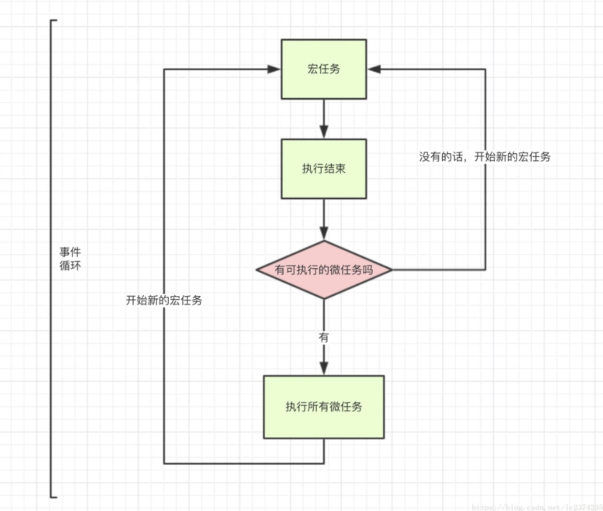
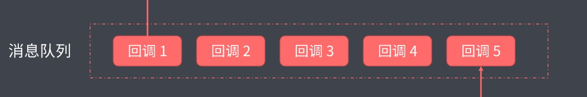

# 一.如何理解异步编程？

  1. javascript是单线程的，一个任务完成之后，才可以继续下一个任务。
  2. 如果有比较耗时的任务时，会影响程序运行，造成用户体验不友好。
  3. 我们可以采用异步方式，像ajax，读取文件等，我们不必等待结果返回，就可以继续执行下面操作
  4. 当结果返回后，可以采用回调函数方式执行。常用的异步解决方法有：callback回调，Promise，Generator，async/await
  
  &nbsp;
# 二.EventLoop(事件循环)是做什么的？
  
  1. 宏任务队列取出第一个宏任务，从上往下执行，同步代码直接运行，
  2. 异步代码：当遇到宏任务时，把它放到宏任务队列里，遇到微任务时，放到微任务队列里。
  3. 当前宏任务执行完成，如果存在微任务，再执行所有的微任务。
  4. 然后开启新一轮的执行，依次循环。

  

  &nbsp;
# 三.消息队列(Task Queue)是做什么的？
  它是一个先进先出的队列，用来存放异步操作的回调函数

  

  &nbsp;
# 四.什么是宏任务？
宏任务有：script(整体代码)，setTimeout，setInterval，setImmediate(Node独有)，I/O，UI rendering

  &nbsp;
# 五.什么是微任务？
微任务有：process.nextTick(node独有)，Promise，Object.observe，MutationObserver(html5新特性)