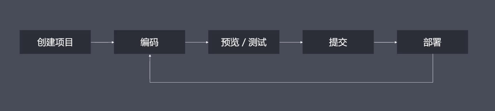
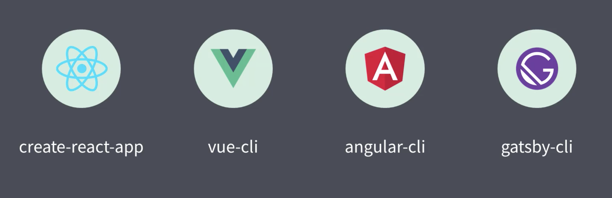

###### 前端工程化呢，是指遵循一定的标准和规范，通过工具降低成本、提高效率的一种手段。

因为前端应用要求不断提高，这些年也被经常探讨。

1. 前端工程化，也是为了解决我们目前存在的一些问题？
   （1）想用 es6 新语法，但是有兼容性问题
   （2）想用 less 或者是 sass 增强 css 的编程性，但是运行环境不支持
   （3）想用模块化的方式提高项目的可维护性，但是运行环境不能直接支持

另外，还有我们在开发完成后，上线前需要手动压缩、合并代码及资源文件，部署过程需要手动上传代码到服务器。这种的手动操作呢，会出现各种各样的问题。在多人开发过程中，我们很难统一大家的代码风格，从仓库 pull 下来的代码也无法保证质量。

包括我们在开发一些功能时，需要等待后台服务接口提前完成。这些都是我们在前端开发中，所遇到的一些问题。归结来看呢，前端工程化，可以帮助我们解决以下几点问题：

- 传统语言或语法的弊端
- 无法使用模块化/组件化
- 重复的机械式工作
- 代码风格统一、质量保证
- 依赖后端服务接口支持
- 整体依赖后端项目

2.  工程化表现：
    它可以帮助我们提高效率，降低成本，保证质量

    

    

    

    我们可以从以上几个方面入手：

    创建项目阶段：使用脚手架工具，生成项目结构和特定类型文件

    编码阶段：自动化格式化代码，校验代码风格，编译、构建以及打包

    预览/调试阶段：借助现代化的 web server，提供热更新的体验。通过 source map，定位代码问题。还可以在后台接口未提供之前，自己 mock 数据。

    提交阶段：可以通过 git hooks，做代码质量检查。可以对提交日志（git log），做格式限制。
    
    部署阶段：用一行命令代替手动 ftp 上传，并且实现持续集成，自动化部署。
    
3. 但是，我们说工程化不等于工具

   工具不是工程化的核心，工程化的核心，指的应该是项目整体的一种规划，或者说是架构。工具只是我们在实现工程化过程当中，使用的一种手段。

   比如说，我们要规范文件的组织结构，代码文件的开发范式（语法、规范、标准），通过什么样的方式作前后端分离。

   我们要考虑搭配哪些工具，做哪些具体的配置选项，来实现工程化整体的一个规划。

   以下是我们常用的成熟的工程化集成：

   

   

4. 前端的工程化，应该归功于 node.js

   我们平时用的工具，基本上都是 node.js 开发的