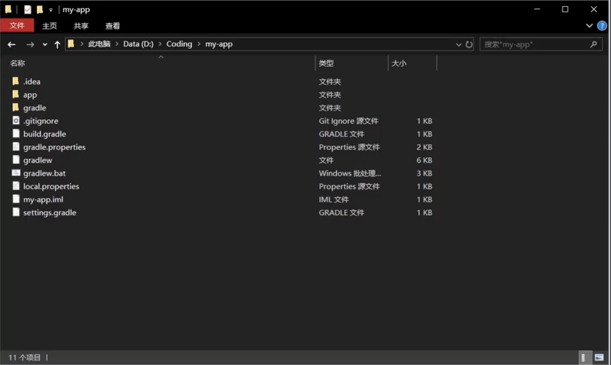

###### 我们说，脚手架的本质所用，就是用来帮我们创建一个基础的项目结构，给我们提供项目规范和约定。

在一个项目中，我们可能会有：

相同的组织结构
相同的开发范式
相同的模块依赖
相同的工具配置
相同的基础代码

这就造成，我们在开发一个新的项目时，有大量的重复操作要做，脚手架工具就是帮助我们来解决这类问题的。

比如，以下截图就是我们通过脚手架生成的一个项目结构：

我们来看下常用的脚手架工具有哪些：

react 项目 -> create-react-app
vue 项目 -> vue-cli
angular 项目 -> angular-cli

通用型脚手架生成工具：Yeoman（灵活，方便扩展）
它是用于创造现代化 web 应用的脚手架工具，不同于其他脚手架工具，yeoman 更像是一个脚手架运行平台。
