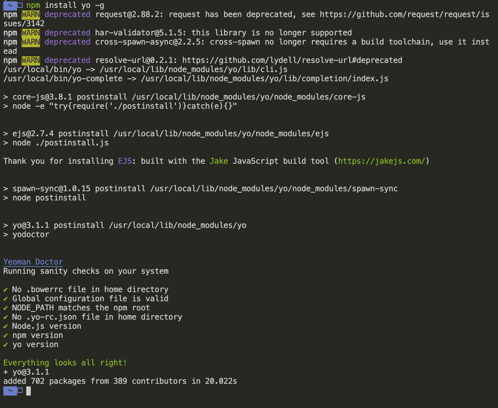
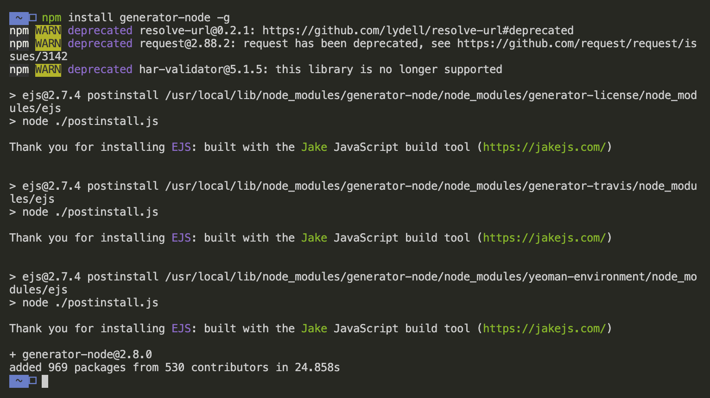
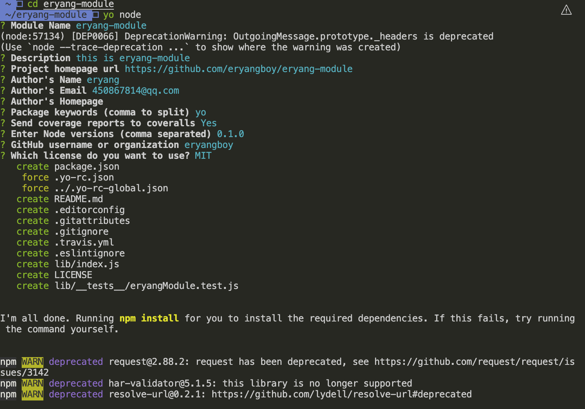
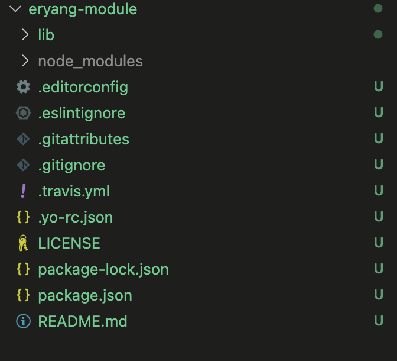

（1）在全局范围安装 yo

```bash
 npm install yo -g
```



(2) 安装对应的 generator

npm install generator-node -g



(3) 创建一个新的文件夹：mkdir eryang-module

(4) 进入文件夹： cd eryang-module

(5) 通过 yo 运行 generator

yo node

根据命令行交互填写完成，生成一个目录结构，如下图：





## Yeoman 常规使用步骤

- 明确需求
- 找到合适的 Generator
- 全局范围安装找到的 Generator
- 通过 yo 运行对应的 Generator
- 通过命令行交互填写选项
- 生成所需要的项目结构
