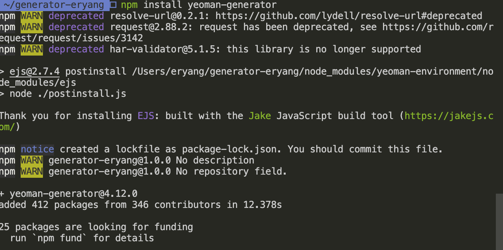
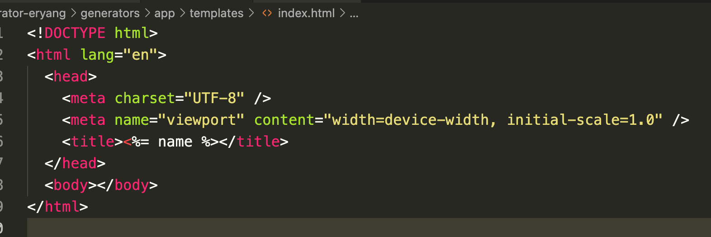
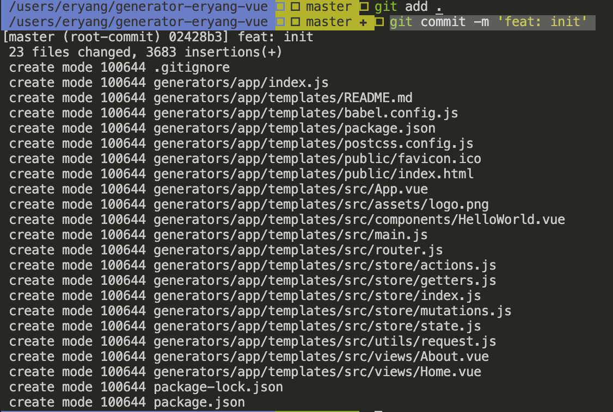
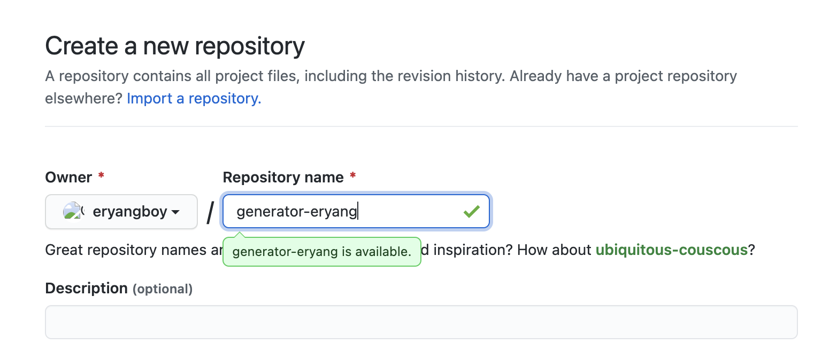
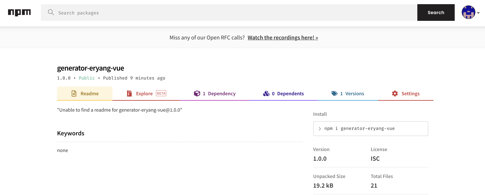
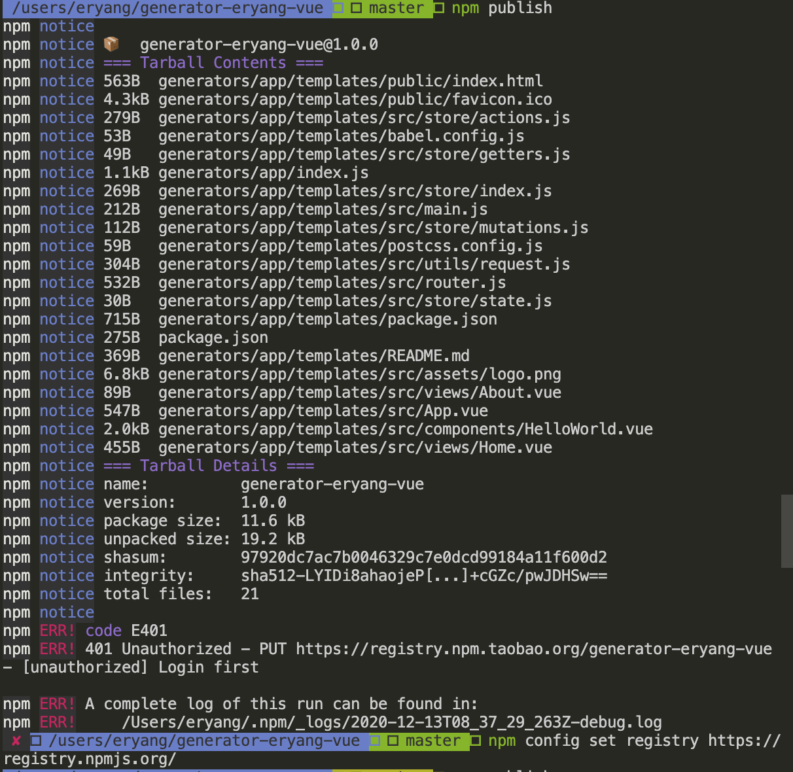
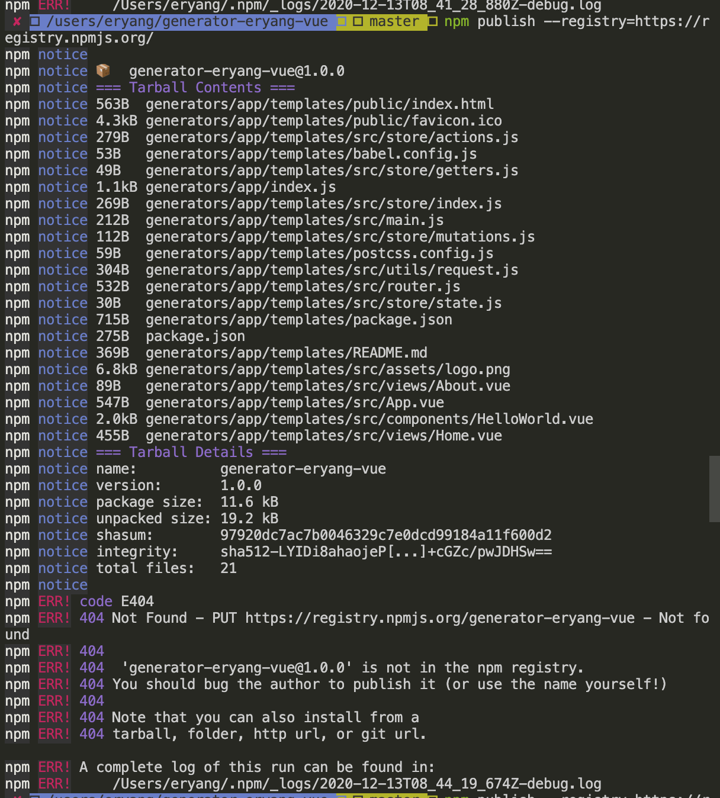

## 创建 Generator 模块

本质上就是一个 npm 模块


Generator 有基本结构，需要有一个 generators 文件夹，app 文件夹里放生成器所对应的代码


如果有多个 sub Generator，可以在 app 同级创建新的一个生成器目录


Yeoman 的生成器模块名称必须是：generator-< name > 这样的格式

(1) 创建一个文件夹：mkdir generator-eryang
(2) 进入文件夹：cd generator-eryang
(3) 初始化 package.json：npm init
(4) 安装 yeoman-generator 模块，它是我们创建生成器的一个基类：npm install yeoman-generator



(4) 按照结构要求创建 generators/app/index.js 文件

- index.js 作为 Generator 的核心入口
- 需要导出一个继承自 Generator 的类型
- Yeoman Generator 在工作时会自动调用我们在此类型中一些生命周期方法
- 我们在这些方法中可以通过调用父类中的一些工具方法实现一些功能，比如文件写入

```js
const Generator = require("yeoman-generator");

module.exports = class extends (
  Generator
) {
  writing() {
    this.fs.write(this.destinationPath("temp.txt"), Math.random().toString());
  }
};
```

(5) 通过 npm link 方式，把这个模块链接到全局范围，使之成为一个全局模块包。这样，yeoman 在工作的时候，可以找到我们所创建的 generator-eryang 模块。

接下来，我们通过命令来测试一下。

（1）首先创建一个新的目录：mkdir my-pro
（2）进入目录文件夹：cd my-pro
（3）然后运行命令：yo eryang


最后，我们在 my-pro 看到，生成了一个 temp.txt 文件，文件里就是我们所写入的内容

## 根据模版创建文件

因为很多时候，我们需要创建的文件有很多，而且文件的内容也相对复杂。那针对这样一种情况，我们可以使用模版去创建文件。

（1）首先在生成器目录下，添加一个 templates 目录
（2）然后将我们需要生成的文件，全部放入这个目录里，作为模版，内部可以使用 EJ 模版标记输出数据，例如：<%= title %>，其他的 EJS 语法也支持。

接下来，我们来以下具体实现：

```js
const Generator = require("yeoman-generator");

module.exports = class extends (
  Generator
) {
  writing() {
    // 通过模版方式写入文件到目标目录

    // 模板文件路径
    const temp = this.templatePath("foo.txt");
    // 输出目标路径
    const output = this.destinationPath("foo.txt");
    // 模板数据上下文
    const context = { title: "hello", success: false };

    this.fs.copyTpl(temp, output, context);
  }
};
```

运行：yo eryang，我们会看到文件夹中新生成 foo.txt 文件


相对于手动创建每一个文件，模板的方式大大的提高了效率，特别是在文件比较多，比较复杂的情况下。

## 接受用户输入数据

像项目中的动态数据，我们一般通过命令行交互的方式，去询问我们的使用者从而得到，比如标题，项目的名称。prompting 方法，帮助我们实现这些功能。

```js
const Generator = require("yeoman-generator");

module.exports = class extends (
  Generator
) {
  prompting() {
    // Yeoman在询问用户环节会自动调用此方法
    // 在此方法中可以调用父类的prompt()发出对用户的命令行询问
    return this.prompt([
      {
        type: "input",
        name: "name",
        message: "your project name",
        default: this.appname, // 项目生成目录名称
      },
    ]).then((answer) => {
      // answers = {name : 'user input value'}
      this.answers = answer;
    });
  }

  writing() {
    // 通过模版方式写入文件到目标目录

    // 模板文件路径
    const temp = this.templatePath("index.html");
    // 输出目标路径
    const output = this.destinationPath("index.html");
    // 模板数据上下文
    const context = this.answers;

    this.fs.copyTpl(temp, output, context);
  }
};
```

再次运行：yo eryang，我们首先会收到命令行的提示信息：? your project name: my pro
默认为：my pro，然后我们回复完之后，文件夹中依新生成 index.html 文件，并且<%= name %>已被替换为我们所回复的 my pro。


模版文件



生成后文件


## 发布 Generator

实际上是发布一个 npm 模块（通过 npm publish 命令实现）


(1）首先我们先忽略 node_modules 文件夹：echo node-modules > .gitignore
(2）然后初始化 git，创建一个空仓库：git init



(3) 添加文件：git add .
(4) 完成一次提交：git commit -m 'feat: init'



(5) 打开 github.com，创建一个远端仓库，名字叫做 generator-eryang

(6) 为本地仓库添加一个远端仓库的别名：git remote add origin https://github.com/eryangboy/generator-eryang.git


(7) 推送到远端仓库：git push -u origin master



(8) 发布模块: npm publish

### ßnpm publish 发布失败常见错误总结：

- 版本号重复，无法发布
  解决方案：修改 package.json 里面的 version 字段。

- 没有 adduser
  没有权限导致发布失败，解决方案是：npm adduser，然后输入用户名、密码、邮箱。

- registry 不对，需要配置镜像地址
  镜像地址如果配置的是淘宝，而你需要发布到的是 npm 官方仓库，这个时候需要修改你的 registry。

```bash
npm config set registry=http://registry.npmjs.org
```






