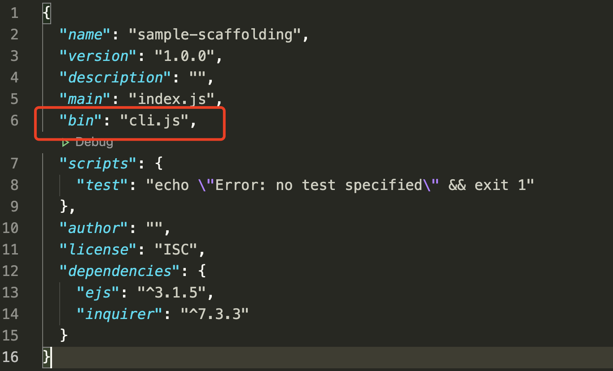
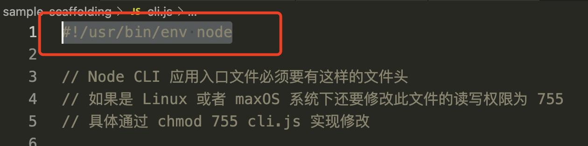

## 脚手架的工作原理：

- 通过命令行交互查询用户问题
- 根据用户回答的结果生成文件

(1) 首先呢，我们创建一个文件夹：mkdir sample-scaffolding
(2) 进入文件夹目录：cd sample-scaffolding
(3) 初始化 package.json 文件：npm init
(4) 在 package.json 文件中指定 cli 应用的入口文件



(5) 创建 cli.js 文件，并且设置头部为 #!/usr/bin/env node



(6) 通过 npm link 链接到全局

(7) 配置询问用户信息，需要安装 inquirur 模块：npm install inquirur
(8) 配置过程，详细看以下代码

```js
#!/usr/bin/env node

// Node CLI 应用入口文件必须要有这样的文件头
// 如果是 Linux 或者 maxOS 系统下还要修改此文件的读写权限为 755
// 具体通过 chmod 755 cli.js 实现修改

// 脚手架的工作过程：

// console.log("cli working");

const inquirur = require("inquirer"); // 询问用户信息模块
const path = require("path");
const fs = require("fs");
const ejs = require("ejs"); // 模版引擎

inquirur
  .prompt([
    {
      type: "input", // 问题输入方式
      name: "name", // 问题返回的键
      message: "your project name", // 提示信息
    },
  ])
  .then((answers) => {
    // answers 为用户回答的答案

    // 根据用户回答的结果生成文件

    // console.log(answers);
    // _dirname 为当前目录

    // 模板目录
    const tmplDir = path.join(__dirname, "templates");
    // console.log(__dirname, tmplDir);
    // /Users/eryang/sample-scaffolding /Users/eryang/sample-scaffolding/templates

    // 目标目录
    const destDir = process.cwd();
    // console.log(destDir);

    // 将模板下的文件，全部放到目标目录
    fs.readdir(tmplDir, (err, files) => {
      if (err) throw err;
      //   console.log(files);   --   [ 'index.html', 'style.css' ]
      files.forEach((file) => {
        // 通过模版引擎渲染文件

        // renderFile参数为：路径，数据，回调函数
        ejs.renderFile(path.join(tmplDir, file), answers, (err, result) => {
          if (err) throw err;
          //   console.log(result);
          // 将结果写入目标文件路径
          fs.writeFileSync(path.join(destDir, file), result);
        });
      });
    });
  });
```
