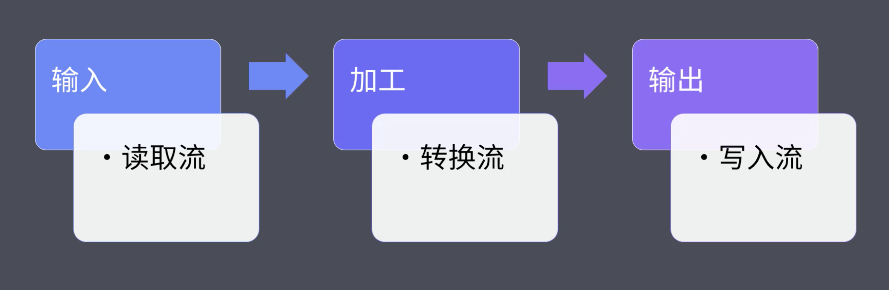

## gulp 基本使用

当下最流行的前端构建系统，高效、易用

1. 初始化 package.json：npm init -yes

2. 安装 gulp：npm install gulp -dev

3. 创建入口文件 gulpfile.js

4. 需要导出一个函数

   

```js
exports.foo = (done) => {
  console.log("gulp working");
  done(); // 标识任务完成
};
```


执行 gulp foo，会报一个错误，这是因为 gulp 约定每一个任务都是异步任务，需要调用一个回调参数标记任务完成

### gulp 创建组合任务

- series：串行任务结构

```js
const { series, parallel } = require("gulp");

const task1 = (done) => {
  setTimeout(() => {
    console.log("task1 working~");
    done();
  }, 1000);
};

const task2 = (done) => {
  setTimeout(() => {
    console.log("task2 working~");
    done();
  }, 1000);
};

const task3 = (done) => {
  setTimeout(() => {
    console.log("task3 working~");
    done();
  }, 1000);
};

exports.foo = series(task1, task2, task3);
```


- parallel：并行任务结构

```js
const { series, parallel } = require("gulp");

const task1 = (done) => {
  setTimeout(() => {
    console.log("task1 working~");
    done();
  }, 1000);
};

const task2 = (done) => {
  setTimeout(() => {
    console.log("task2 working~");
    done();
  }, 1000);
};

const task3 = (done) => {
  setTimeout(() => {
    console.log("task3 working~");
    done();
  }, 1000);
};

exports.foo = parallel(task1, task2, task3);
```


### gulp 异步任务的三种方式

1. 第一种是回调方式

```js
exports.callback = (done) => {
  console.log("calback task");
  done();
};
```

- 如果想阻止剩下任务执行，可以 done(一个错误)

```js
exports.callback_error = (done) => {
  console.log("calback task");
  done(new Error('task failed));
};
```

2. 第二种是 Promise

```js
exports.promise = () => {
  console.log("promise task");
  Promise.resolve();
};
```

- 如果想阻止剩下任务执行，可以 reject(一个错误)

```js
exports.promise_error = () => {
  console.log("calback task");
  Promise.reject(new Error("promise failed"));
};
```

3. 第三种是 Async/await

```js
const timeout = (time) => {
  return new Promise((resolve) => {
    setTimeout(resolve, time);
  });
};

exports.async = async () => {
  await timeout(2000);
  console.log("async task");
};
```

### gulp 构建过程核心工作原理

1. 首先是复制操作

```js
const fs = require("fs");

exports.default = () => {
  // 文件读取流
  const read = fs.createReadStream("normalize.css");
  // 文件写入流
  const write = fs.createWriteStream("normalize.min.css");

  // 把读取出来的文件读取流导入到文件写入流
  read.pipe(write);
  return read;
};
```

2. 然后是转换操作

```js
const fs = require("fs");
const { Transform } = require("stream");

exports.default = () => {
  // 文件读取流
  const read = fs.createReadStream("normalize.css");
  // 文件写入流
  const write = fs.createWriteStream("normalize.min.css");

  // 文件转换流
  const transform = new Transform({
    transform: (chunk, encoding, callback) => {
      // 核心转换过程实现
      // chunk：读取流中读取到的内容（Buffer）
      const input = chunk.toString();
      const output = input.replace(/\s+/g, "").replace(/\/\*.+?\*\//g, "");
      callback(null, output); // 错误优先，没有错误传入null
    },
  });

  // 把读取出来的文件读取流导入到文件写入流
  read
    .pipe(transform) // 转换
    .pipe(write); // 写入

  return read;
};
```



### gulp 文件操作 api 和插件的使用

1. 复制操作

```js
const { src, dest } = require("gulp");

exports.default = () => {
  return src("src/*.css").pipe(dest("dist"));
};
```

2. 转换操作

```js
const { src, dest } = require("gulp");
const cssClean = require("gulp-clean-css");
const rename = require("gulp-rename");

exports.default = () => {
  return src("src/*.css")
    .pipe(cssClean())
    .pipe(rename({ extname: ".min.css" }))
    .pipe(dest("dist"));
};
```
