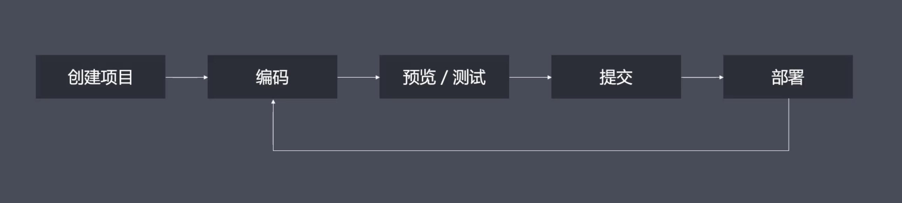

#### 一、谈谈你对工程化的初步认识，结合你之前遇到过的问题说出三个以上工程化能够解决问题或者带来的价值。

前端工程化呢，是指遵循一定的标准和规范，通过工具降低成本、提高效率的一种手段。

前端工程化，也是为了解决我们目前存在的一些问题？
（1）想用 es6 新语法，但是有兼容性问题
（2）想用 less 或者是 sass 增强 css 的编程性，但是运行环境不支持
（3）想用模块化的方式提高项目的可维护性，但是运行环境不能直接支持

- 传统语言或语法的弊端
- 无法使用模块化/组件化
- 重复的机械式工作
- 代码风格统一、质量保证
- 依赖后端服务接口支持
- 整体依赖后端项目

2. 工程化表现：
   它可以帮助我们提高效率，降低成本，保证质量

   

   我们可以从以上几个方面入手：

   创建项目阶段：使用脚手架工具，生成项目结构和特定类型文件

   编码阶段：自动化格式化代码，校验代码风格，编译、构建以及打包

   预览/调试阶段：借助现代化的 web server，提供热更新的体验。通过 source map，定位代码问题。还可以在后台接口未提供之前，自己 mock 数据。

   提交阶段：可以通过 git hooks，做代码质量检查。可以对提交日志（git log），做格式限制。

   部署阶段：用一行命令代替手动 ftp 上传，并且实现持续集成，自动化部署。

#### 二、你认为脚手架除了为我们创建项目结构，还有什么更深的意义？

1. 脚手架还帮我们制定了项目规范和约定
2. 便于多人协作，提高开发效率

